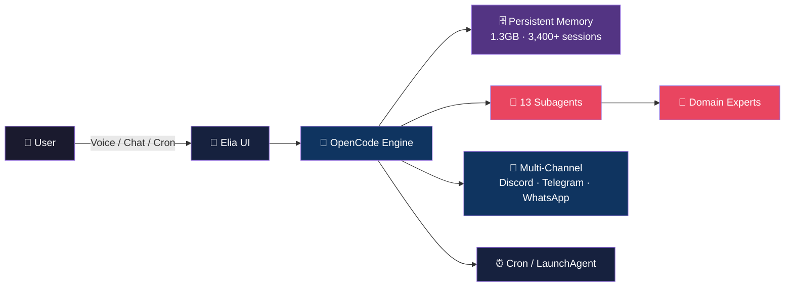

<div align="center">

# 🧠 Elia Agent

### Your Self-Improving AI Operating System

**Persistent Memory · 13 Specialized Subagents · Multi-Channel Autonomy**

[](https://opencode.ai)
[]()
[]()
[]()
[]()
[]()

</div>

---

## ✦ The Pitch in 10 Seconds

**Most AI agents start from zero every session.** Elia remembers everything. Every decision, every fix, every discovery — indexed, searchable, and automatically loaded into future sessions. The more you use it, the smarter it gets.



---

## ✦ What Makes Elia Different

### 🔁 The Self-Improvement Loop

```
 Session ──→ Captures decisions, fixes, discoveries
    │
    ▼
 SQLite Memory (1.3GB) ──→ Per-agent indexed recall
    │
    ▼
 Next run → loads relevant context → avoids past mistakes
    │
    ▼
 Agent gets smarter every session ──→ Loop repeats
```

**3,400+ sessions accumulated. Every run builds on the last.**

### 👥 13 Specialized Subagents

Unlike a single monolithic agent, Elia delegates to **domain experts**:

| Agent | Domain | Signature |
|-------|--------|-----------|
| **Oliver** | Backend · APIs · Docker · CI/CD | *"The solution is straightforward."* |
| **James** | Frontend · React · UI/UX | *"It should make you want to click."* |
| **William** | Finance · Invoicing · Payments | *"Money follows when work is done well."* |
| **Victoria** | Marketing · TikTok · Snapchat | *"The best marketing doesn't feel like marketing."* |
| **Charles** | Sales · Lead gen · Closing | *"The deal isn't closed until it's signed."* |
| **Elizabeth** | HR · Recruitment | *"The best hires are the ones you don't hesitate on."* |
| **Marcus** | Content · Video · FFmpeg | *"Content is king, distribution is queen."* |
| **Charlotte** | Luxury E-commerce | *"Luxury is in the details."* |
| **Alexander** | Partnerships | *"Strong partnerships, strong business."* |
| **Sebastian** | Operations · Jira · SaaS | *"A great system improves itself."* |
| **Catherine** | Customer Comms · WhatsApp | *"Every message is an impression."* |
| **Ethan** | Snapchat Growth | *"Speed beats perfection."* |
| **Eleanor** | TikTok/YouTube Automation | *"Work smart, automate the rest."* |

Each subagent has its own **personality file, workflow rules, and indexed memory** — no context pollution between domains.

### 📡 Multi-Channel Access

| Channel | Method | What You Can Do |
|---------|--------|----------------|
| 💬 **Discord** | `@elia_bot` | Chat, slash commands, file reports |
| 📱 **Telegram** | `/extraprompt` | Deploy tasks, get summaries |
| 🗣️ **Voice** | Click the orb | Dictate, Whisper → action |
| 🖥️ **Electron UI** | Floating overlay | Pick model, manual runs |
| ⏰ **Cron / LaunchAgent** | Scheduled | Morning brief, recurring tasks |
| 🔄 **Proxy** | Auto-rotate | Region-switching for growth ops |

### 🧠 Persistent Memory System (Codemem)

| Feature | Detail |
|---------|--------|
| **Hybrid search** | Semantic (embeddings) + keyword |
| **Per-agent scoping** | Each subagent has its own indexed history |
| **Auto context injection** | Relevant past sessions loaded automatically |
| **SQLite-backed** | 1.3GB+ database, 3,400+ indexed sessions |
| **Handoff continuity** | Preserves context across task switches |
| **Cross-device sync** | Shared memory across machines |

---

## ✦ Architecture Overview

```
┌─────────────────────────────────────────────────────────────┐
│                     ENTRY POINTS                            │
├─────────────────────────────────────────────────────────────┤
│                                                              │
│  CRON ──→ manage_cron.sh ──→ trigger_opencode_interactive.sh│
│  VOICE ──→ start_agents.sh ──→ trigger_opencode_interactive │
│  TELEGRAM ──→ /extraprompt ──→ trigger_opencode_interactive  │
│  DISCORD ──→ bot.py ──→ opencode session                     │
│  CLI ──→ start_agents.sh [args]                              │
│                                                              │
├─────────────────────────────────────────────────────────────┤
│                                                              │
│  oh-my-opencode run -a <agent> "<task>"                      │
│      ├── ULW-Loop (unlimited iterations)                      │
│      └── Ralph-Loop (50 iter max)                            │
│                                                              │
├─────────────────────────────────────────────────────────────┤
│                                                              │
│  OPENCODE ENGINE                                              │
│      ├── Model: opencode/big-pickle (free)                   │
│      ├── MCP Servers (Playwright, SSH, Discord, WhatsApp)    │
│      └── Plugin System (Langfuse, oh-my-opencode)            │
│                                                              │
├─────────────────────────────────────────────────────────────┤
│                                                              │
│  MEMORY LAYER                                                 │
│      ├── Codemem SQLite (1.3GB)                               │
│      ├── Context files (business, tools, memory)              │
│      └── Subagent personality files (.md)                     │
│                                                              │
└─────────────────────────────────────────────────────────────┘
```

---

## ✦ Quick Start

```bash
# 1. Clone the repo
git clone https://github.com/vakandi/EliaAgent.git
cd EliaAgent

# 2. Choose your platform
./setup/installer.sh                   # macOS / Linux
# OR
setup\installer.bat                     # Windows

# 3. Run Elia
./scripts/start_agents.sh --model=big-pickle
```

### Model Selection (100% free — no API costs)

| Model | Context | Use Case |
|-------|---------|----------|
| `big-pickle` | 200K tokens | Default — best all-rounder |
| `minimax-m2.5-free` | 1M tokens | Heavy document processing |

> **Zero API costs.** Elia uses only free OpenCode models. No Claude, no GPT, no surprise bills.

### First Run Customization

```bash
# Replace the context files with YOUR info
vim context/business.md          # Your businesses, team
vim context/MEMORY.md            # Long-term memory
vim context/TOOLS.md             # Your tools, MCP servers

# Then run with your custom agent
/ulw-loop I want to set up Elia for my life and business
```

---

## ✦ Project Layout

```
EliaAgent/
├── ui_electron/              # Floating overlay app (Electron)
├── scripts/                   # Entry points & automation
│   ├── start_agents.sh        # CLI entry point
│   ├── trigger_opencode_interactive.sh  # Main runner
│   ├── manage_cron.sh         # Install/remove scheduled jobs
│   └── voice-command.sh       # Voice dictate
├── integrations/              # Channel plugins
│   ├── elia-discord-bot/      # Discord bot (bot.py)
│   └── telegram-opencode-bot/ # Telegram bot
├── setup/                     # Installers & config
│   ├── installer.sh           # macOS/Linux installer
│   ├── switch-proxy.sh        # Proxy rotation
│   └── proxies.txt            # Proxy list
├── context/                   # YOUR business context (edit these!)
├── brain/                     # Codemem memory storage
├── memory/                    # Additional context files
├── skills/                    # Specialized knowledge skills
├── tools/                     # Utility tools
├── docs/                      # Session documentation
├── subworkers/                # Background worker configs
├── PROMPT.md                  # Main system prompt
└── MORNING_PROMPT.md          # Morning briefing prompt
```

---

## ✦ Key Capabilities

### ⏰ Scheduled Autonomy
```bash
./manage_cron.sh install --interval 2h --start 10 --end 22
```
Runs Elia every 2 hours automatically. Picks the model you selected in the UI.

### 🗣️ Voice-Driven Work
Click the orb → dictate → Whisper transcribes → Elia executes. Hands-free productivity.

### 🔄 Proxy Auto-Rotation
```bash
sp    # Auto: picks the least-used proxy
spm   # Manual: pick from list
```
Essential for growth ops, market research, and region-specific tasks.

### 📊 Langfuse Telemetry
Every session traced: tool calls, costs, timing, performance. Dashboard at cloud.langfuse.com.

### 🌐 Cross-Platform
| Platform | Status | Launcher |
|----------|--------|----------|
| macOS | ✅ Primary | `installer.sh` |
| Linux | ✅ Supported | `installer.sh` |
| Windows | ✅ Supported | `installer.bat` |

---

## ✦ Tech Stack

| Layer | Technology |
|-------|-----------|
| AI Engine | [OpenCode](https://opencode.ai) with big-pickle model |
| UI | Electron + HTML/CSS/JS |
| Memory | SQLite (codemem) with hybrid search |
| Integrations | Discord.py, python-telegram-bot, mcp-cli |
| Automation | Bash, cron, LaunchAgent |
| Telemetry | Langfuse (OpenTelemetry) |
| Proxy | HTTP_PROXY env vars, proxychains fallback |
| Voice | Whisper (dictation), elia-voxtral-speak (TTS) |

---

## ✦ Documentation

| Topic | Link |
|-------|------|
| Full setup guide | [setup/README.md](setup/README.md) |
| Windows setup | [setup/README_WINDOWS.md](setup/README_WINDOWS.md) |
| System prompt | [PROMPT.md](PROMPT.md) |
| Morning routine | [MORNING_PROMPT.md](MORNING_PROMPT.md) |
| Subworker system | [setup/SUBWORKERS_SYSTEM.md](setup/SUBWORKERS_SYSTEM.md) |
| Release notes | [setup/RELEASENOTES.md](setup/RELEASENOTES.md) |

---

<div align="center">

**Built to make you and your team go faster.**  
*Heavy work, long tasks, administrative grind —*  
*Elia handles it so you don't have to.*

[](https://github.com/vakandi/EliaAgent)
[](https://github.com/vakandi/EliaAgent/fork)

---

#### 📬 Need help? Open an [issue](https://github.com/vakandi/EliaAgent/issues)

</div>
